# Realtime CPU octree splatting

* [Introduction](#introduction)
* [The basic algorithm](#the-basic-algorithm)
* [Ways to split a cuboid](#ways-to-split-a-cuboid)
* [Octree storage](#octree-storage)
* [Nuts and bolts](#nuts-and-bolts)
* [The full(er) picture](#the-fuller-picture)
* [Benchmarking](#benchmarking)
* [General optimizations](#general-optimizations)
* [Algorithmic tricks](#algorithmic-tricks)
* [Cheating](#cheating)
* [Bells and whistles](#bells-and-whistles)
* [Return of the samurai](#return-of-the-samurai)
* [Vs. Animation](#vs-animation)
* [Afterword](#afterword)

---

## Introduction

For the vast majority of games, using GPU for rendering is the most (or only) practical approach.

Why would anyone bother with CPU rendering, nowadays?

* Often, it's for the sake of challenge in a constrained environment [[A1][pico8], [A2][retro-ngon], [A3][asciicker]], or simply as a learning experience [[A4][ssloy], [A5][ttsiodras]].
* In some cases, people just don't need the extreme speed of modern GPUs for their projects, and would rather use a slower but predictable / tweakable / simple renderer that works anywhere [[B1][small3dlib], [B2][gamedev-703265]].
* CPUs have their own strengths [[C1][gpgpu-vs-multicore], [C2][intel-occlusion-culling]], and on modern multi-core processors software rendering can even reach competitive performance [[C3][gallium-2019], [C4][thanassis]].

[pico8]: https://itch.io/games/free/tag-3d/tag-pico-8 "3D games in PICO-8"
[retro-ngon]: https://github.com/leikareipa/retro-ngon "Retro n-gon renderer by leikareipa"
[asciicker]: https://github.com/msokalski/asciiid "ASCIICKER by msokalski / gumix"
[ssloy]: https://github.com/ssloy/tinyrenderer/wiki/Lesson-0:-getting-started "tinyrenderer by ssloy"
[ttsiodras]: https://github.com/ttsiodras/renderer "TTSIOD Renderer by ttsiodras"

[small3dlib]: https://gitlab.com/drummyfish/small3dlib "small3dlib by drummyfish"
[gamedev-703265]: https://www.gamedev.net/forums/topic/703265-state-of-art-in-real-time-software-rendering/ "gamedev.net discussion about real-time software rendering"

[gpgpu-vs-multicore]: https://stackoverflow.com/questions/5919172/gpgpu-vs-multicore "stackoverflow discussion about GPGPU vs. Multicore"
[intel-occlusion-culling]: https://software.intel.com/content/www/us/en/develop/articles/software-occlusion-culling.html "Software occlusion culling by Intel"
[gallium-2019]: https://www.phoronix.com/scan.php?page=news_item&px=Mesa-20.0-Dec-i965-vs-Gallium "Gallium3D performance benchmarks, 14 December 2019"
[thanassis]: https://www.thanassis.space/renderer.html "TTSIOD Renderer by ttsiodras"

For me, the primary motivation was curiosity.

Back when the first ["Unlimited Detail" video](https://www.youtube.com/watch?v=Q-ATtrImCx4 "This is a re-upload by someone else; the original video is no longer on YouTube") was making rounds, I got really intrigued how they managed to pull that off. To my knowledge, CPUs were simply too *slow* for anything of that complexity... yet here was a clear demonstration that such a thing was *possible*.

At the time, many other people were also stumped as to what their algorithm was. Which is kinda weird, because [an idea so old](https://www.researchgate.net/publication/236492842_Efficient_synthetic_image_generation_of_arbitrary_3-d_objects "Front-to-back octree splatting with occlusion culling, proposed by Meagher in 1982") and simple (and really obvious, in hindsight), by all rights, shouldn't have been quite so obscure.

Still, no tutorials or articles on software rendering I've seen back then have mentioned that method... and even though I later stumbled upon various demos by other people [[D1][pnd3d], [D2][epic-point-cloud], [D3][pwtech], [D4][phreda4]] that demonstrated comparable results, there was either no source code at all, the code was too esoteric/convoluted, or simply not very efficient.

[pnd3d]: http://advsys.net/ken/voxlap/pnd3d.htm "PND3D by Ken Silverman"
[epic-point-cloud]: https://www.youtube.com/watch?v=W-hOoBa1hxo "Epic Point Cloud renderer by Richard Svensson"
[pwtech]: https://github.com/EyeGem/pwtech "PWTECH by EyeGem"
[phreda4]: https://github.com/phreda4/r4 "r4 by Pablo Hugo Reda"

So, lacking a well-established solution to realtime pointcloud/voxel rendering on CPU, I set out to do my own experiments. A lot of the things I tried didn't work -- but, eventually, I got to the point where my single-threaded renderer could run in 640x480 at realtime-ish framerates. Granted, I'm writing it in C# / Unity, so there's plenty of room for more low-level optimizations... but even in the theoretically optimal case, [it would still be miles behind](http://www.codersnotes.com/notes/euclideon-explained/ "Debunking Euclideon's Unlimited Detail Tech by Richard Mitton") any GPU-based engine.

That said -- if anyone is interested, here's what I learned or figured out along the way :-)

---

## The basic algorithm

The core idea is very simple: traverse the octree in front-to-back order, projecting each node to screen. Draw the leaf and pixel-sized nodes, skip the out-of-view and fully-occluded nodes.

I'll use Python-like pseudocode for simplicity:

```python
def Render(node):
    boundingBox = CalculateScreenSpaceBoundaries(node)
    
    if IsOutOfView(boundingBox): return
    
    projectedSize = max(boundingBox.SizeX, boundingBox.SizeY)
    
    if node.IsLeaf or (projectedSize <= 1):
        Draw(boundingBox, node)
        return
    
    if IsFullyOccluded(boundingBox): return
    
    for octant in CalculateFrontToBackOrder(node):
        if node.HasChild(octant):
            Render(node.GetChild(octant))
```

This gives the O(N<sub>pixels</sub>) average-case performance scaling, virtually independent of model complexity. Technically, raycasting also scales this way, but splatting avoids a lot of work (and cache misses) by processing each node only once.

Of course, theoretical scaling doesn't automatically translate into good speed in practice. If you implement this basic algorithm naively, you'll see realtime framerates only at very *small* resolutions. So, how do we improve it?

Well, before getting into specifics, we first need to address a couple of important architectural choices.

---

## Ways to split a cuboid

There are two main approaches to calculate the geometry of octree (and quadtree) subnodes from their parent. Here I'll refer to them as "slicing" and "tiling":

| Slicing | Tiling |
| :---: | :---: |
| 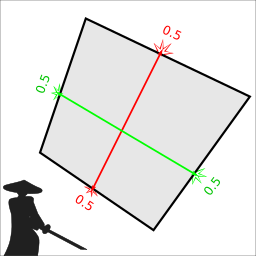 | 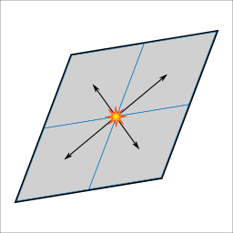 |

**Slicing:** the corners of subnodes either coincide with the parent's corners, or lie at the [centroids](https://en.wikipedia.org/wiki/Centroid) of the parent's edges / faces / all vertices. This sort of "slices" each face along its [bimedians](https://en.wikipedia.org/wiki/Quadrilateral#Bimedians), hence the samurai :)

**Tiling:** each subnode is a twice-smaller copy of the parent shape, translated by some offset. If the shape is a perfect parallelepiped, the subnodes will tile it exactly.

They both have their pros and cons. Tiling requires much less calculations (and due to [self-similarity](https://en.wikipedia.org/wiki/Self-similarity), a lot of things can be precalculated), but only works for parallelepiped shapes and requires special care to guarantee the absence of gaps. Slicing is considerably more expensive, but gives correct and gapless results under any amount of deformation.

Since we aim for realtime, we can't afford the much lower efficiency of the more general method. Of course, this limits us to rendering only [parallel projections](https://en.wikipedia.org/wiki/Parallel_projection) of cubic volumes and their [affine transformations](https://en.wikipedia.org/wiki/Affine_transformation), but hey -- at least you can do top-down, side-scrolling and isometric games with that :-)

---

## Octree storage

This can have a significant effect on performance. Over the course of my experiments, I settled on the following scheme:

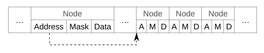

All nodes are stored in a contiguous array, and each node is a struct consisting of:

* Address - the index of this node's first child (subnode) in the array
* Mask - the bitmask of this node's non-empty octants (subnodes)
* Data - the data associated with this node (for example, color)

For this to work, all children of the same parent must be stored in adjacent locations -- but, in the general case, this block of adjacent locations may reside anywhere in the array (which can result in a lot of cache misses during the traversal).

Since it's likely that our renderer will visit many neighboring nodes of the same octree depth (specifically, the one at which nodes are pixel-sized), we can improve data locality by sorting the nodes in their breadth-first traversal order.

There are also a couple of ways we can improve memory usage, if the octree doesn't need to be modified:

* Instead of always storing all 8 children of a node (even if some are empty), we can store only the non-empty ones, at the cost of potentially doing some extra lookups during the traversal.
* We can split the node array into chunks, and store chunks in compressed form. In combination with a virtual addressing / memory paging system, we can unpack on-demand and keep in memory only the chunks we actually need to access.

To be fair, there exists a more memory-efficient approach (at least when it comes to geometry itself), based on directed acyclic graphs [[E1](https://www.cse.chalmers.se/~uffe/HighResolutionSparseVoxelDAGs.pdf "High Resolution Sparse Voxel DAGs"), [E2](https://graphics.tudelft.nl/Publications-new/2020/CBE20/ModifyingCompressedVoxels-main.pdf "Interactively Modifying Compressed Sparse Voxel Representations")]. Its core idea is that octrees typically contain a lot of identical subtrees that can be merged together, which saves quite a bit of memory (although it also reduces data locality). I haven't tried it yet, but I'm aware of at least one person who [has a working implementation](https://github.com/DavidWilliams81/cubiquity "Cubiquity Voxel Engine by DavidWilliams81").

For simplicity, however, here I'll be using the basic storage format outlined above.

---

## Nuts and bolts

With all that out of the way, let's start with a [concrete implementation](https://github.com/dairin0d/OctreeSplatting/blob/205f2bdf98f992ba9fb15649a95758df0eba8a8a/Unity/OctreeSplatting/Assets/OctreeSplatting/OctreeRenderer.cs) of the naive algorithm.

```csharp
// nodeX, nodeY: screen coordinates of the node's center
// nodeZ: min Z coordinate of the node's screen-space bounding box
// address: index of this node in the node array
// level: node's depth in the (sub-)octree
void Render(int nodeX, int nodeY, int nodeZ, uint address, int level) {
    // Calculate screen-space bounding rectangle
    var boundingRect = CalculateScreenSpaceBoundaries(nodeX, nodeY, level);
    
    // Find the part of the rectangle visible within the viewport
    var visibleRect = boundingRect.Intersection(Viewport);
    
    // If the rectangle is invisible, stop processing this node
    if ((visibleRect.SizeX < 0) | (visibleRect.SizeY < 0)) return;
    
    // Read our node array at the specified node address
    var node = Octree[address];
    
    // Find the maximal projected size in pixels
    var projectedSize = Math.Max(boundingRect.SizeX, boundingRect.SizeY);
    
    // If this is a leaf node (indicated by an empty children mask)
    // or it fits within 1 pixel, draw and be done with it
    if ((node.Mask == 0) | (projectedSize < 1)) {
        Draw(visibleRect, nodeZ, node);
        return;
    }
    
    // If the rectangle is fully occluded, stop processing this node
    if (IsFullyOccluded(visibleRect, nodeZ)) return;
    
    for (int i = 0; i < 8; i++) {
        // queue is a pre-calculated front-to-back sequence of octants,
        // packed into the bits of a 32-bit integer
        uint octant = (queue >> (i*4)) & 7;
        
        // Skip this octant if the node has no corresponding child
        if ((node.Mask & (1 << (int)octant)) == 0) continue;
        
        // deltas contains pre-calculated offset vectors for each subnode
        var delta = deltas[octant];
        
        // Calculate subnode position and address
        int childX = nodeX + (delta.X >> level);
        int childY = nodeY + (delta.Y >> level);
        int childZ = nodeZ + (delta.Z >> level);
        var childAddress = node.Address + octant;
        
        // Process the subnode
        Render(childX, childY, childZ, childAddress, level+1);
    }
}
```

`Draw(...)` tests the nodeZ value against the depth of each pixel within the visible rectangle, and overwrites the pixel's depth and color if nodeZ is smaller. `IsFullyOccluded(...)` is very similar, but simply returns `false` as soon as the depth test passes.

```csharp
// Pixels is a row-major 2D array of pixels,
// where each row's length is BufferStride

void Draw(Range2D rect, int nodeZ, OctreeNode node) {
    for (int y = rect.MinY; y <= rect.MaxY; y++) {
        int index = rect.MinX + (y * BufferStride);
        for (int x = rect.MinX; x <= rect.MaxX; x++, index++) {
            ref var pixel = ref Pixels[index];
            if (nodeZ < pixel.Depth) {
                pixel.Depth = nodeZ;
                pixel.Color24 = node.Data;
            }
        }
    }
}

bool IsFullyOccluded(Range2D rect, int nodeZ) {
    for (int y = rect.MinY; y <= rect.MaxY; y++) {
        int index = rect.MinX + (y * BufferStride);
        for (int x = rect.MinX; x <= rect.MaxX; x++, index++) {
            ref var pixel = ref Pixels[index];
            if (nodeZ < pixel.Depth) return false;
        }
    }
    return true;
}
```

In floating-point arithmetic, `CalculateScreenSpaceBoundaries(...)` would be equivalent to the formula *max*, *min* = **floor**(*center* ± (*extent* / 2<sup>*level*</sup> - 0.5)), where *extent* is the root node's half-size. However, since here we use fixed-point arithmetic, the actual implementation looks like this:

```csharp
// SubpixelBits is the number of bits in the fractional part
// of the coordinate's fixed-point representation.
// Correspondingly, SubpixelHalf = (1 << SubpixelBits) / 2

Range2D CalculateScreenSpaceBoundaries(int nodeX, int nodeY, int level) {
    var nodeExtentX = (extentX >> level) - SubpixelHalf;
    var nodeExtentY = (extentY >> level) - SubpixelHalf;
    
    return new Range2D {
        MinX = (nodeX - nodeExtentX) >> SubpixelBits,
        MinY = (nodeY - nodeExtentY) >> SubpixelBits,
        MaxX = (nodeX + nodeExtentX) >> SubpixelBits,
        MaxY = (nodeY + nodeExtentY) >> SubpixelBits,
    };
}
```

Subtracting half-pixels from each edge is necessary for correct pixel coverage in some cases. In the image below, both the original and the shrinked rectangles overlap the same pixel centers, but **floor**()-ing the original rectangle's corners will give wrong results.

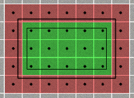

And, for completeness' sake, the `Range2D` implementation is this:

```csharp
public struct Range2D {
    public int MinX, MinY, MaxX, MaxY;
    
    public int SizeX => MaxX - MinX;
    public int SizeY => MaxY - MinY;
    
    public Range2D Intersection(Range2D other) {
        return new Range2D {
            MinX = (MinX > other.MinX ? MinX : other.MinX),
            MinY = (MinY > other.MinY ? MinY : other.MinY),
            MaxX = (MaxX < other.MaxX ? MaxX : other.MaxX),
            MaxY = (MaxY < other.MaxY ? MaxY : other.MaxY),
        };
    }
}
```

Well, that's basically all the logic in the `Render(...)` method. However, it depends on a few pre-calculated variables that deserve their own explanation.

---

## The full(er) picture

The public part of our octree renderer class is quite simple. Rendering a voxel object is just a matter of assigning a few fields and calling the public `Render()` method.

```csharp
public class OctreeRenderer {
    // Viewport & renderbuffer info
    public Range2D Viewport;
    public int BufferStride;
    public PixelData[] Pixels;
    
    // Model info
    public Matrix4x4 Matrix;
    public OctreeNode[] Octree;
    public uint RootAddress;
    
    public void Render() {
        if (!Setup()) return;
        
        Render(startX, startY, startZ, RootAddress, 0);
    }
    
    ...
```

One thing that should be noted here is that `Matrix` is expected to represent an object's coordinate system in renderbuffer space, which ranges from (0, 0, 0) to (Width, Height, Depth). E.g., for a 640x480 buffer with 16-bit depth, this would be (640, 480, 65536).

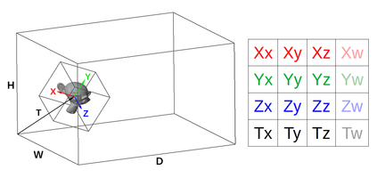

The non-public part looks like this:

```csharp
    ...
    
    private const int SubpixelBits = 16;
    private const int SubpixelSize = 1 << SubpixelBits;
    private const int SubpixelHalf = SubpixelSize >> 1;
    
    private struct Delta {
        public int X, Y, Z;
    }
    
    // Subnode offset vectors
    private Delta[] deltas = new Delta[8];
    
    // Front-to-back sequence of octants
    private uint queue;
    
    // Root node info
    private int extentX, extentY, extentZ;
    private int startX, startY, startZ;
    
    // The int matrix
    private int XX, XY, XZ;
    private int YX, YY, YZ;
    private int ZX, ZY, ZZ;
    private int TX, TY, TZ;
    
    // Render(...) and related methods
    ...
    
    // Setup() and related methods
    ...
}
```

And the `Setup()` itself:

```csharp
bool Setup() {
    int maxLevel = CalculateMaxLevel();
    
    if (maxLevel < 0) return false;
    
    CalculateIntMatrix(maxLevel);
    
    CalculateRootInfo();
    
    if (startZ < 0) return false;
    
    CalculateDeltas();
    
    CalculateQueue();
    
    return true;
}
```

`CalculateMaxLevel()` estimates the depth of octree at which adjacent nodes are guaranteed to be no more than 1 pixel apart.

```csharp
int CalculateMaxLevel() {
    float absXX = Math.Abs(Matrix.M11);
    float absXY = Math.Abs(Matrix.M12);
    float absYX = Math.Abs(Matrix.M21);
    float absYY = Math.Abs(Matrix.M22);
    float absZX = Math.Abs(Matrix.M31);
    float absZY = Math.Abs(Matrix.M32);
    
    float maxGap = 0;
    maxGap = Math.Max(maxGap, absXX + absYX + absZX);
    maxGap = Math.Max(maxGap, absXY + absYY + absZY);
    
    // The integer part of our fixed-point representation
    // contains (32 - SubpixelBits) bits. But to avoid
    // overflows and crashes, we can left-shift at most by
    int maxShift = 28 - SubpixelBits;
    
    for (int maxLevel = 0; maxLevel <= maxShift; maxLevel++) {
        if (maxGap < (1 << maxLevel)) return maxLevel;
    }
    
    return -1; // too big; can't render
}
```

`CalculateIntMatrix(...)` calculates the fixed-point representation of the root node's matrix. To guarantee the absence of gaps, all nodes must lie exactly at the vertices of an integer lattice, with the [lattice vectors](https://en.wikipedia.org/wiki/Bravais_lattice) equal to half-axes of a (sub)pixel-sized node.

```csharp
void CalculateIntMatrix(int maxLevel) {
    // Scale x and y components of axes to 1-pixel precision
    float levelScale = (float)Math.Pow(2, SubpixelBits - maxLevel);
    
    // Calculate fixed-point representations
    XX = (int)(Matrix.M11 * levelScale);
    XY = (int)(Matrix.M12 * levelScale);
    XZ = (int)(Matrix.M13);
    YX = (int)(Matrix.M21 * levelScale);
    YY = (int)(Matrix.M22 * levelScale);
    YZ = (int)(Matrix.M23);
    ZX = (int)(Matrix.M31 * levelScale);
    ZY = (int)(Matrix.M32 * levelScale);
    ZZ = (int)(Matrix.M33);
    TX = (int)(Matrix.M41 * SubpixelSize);
    TY = (int)(Matrix.M42 * SubpixelSize);
    TZ = (int)(Matrix.M43);
    
    // Halve all components of the axes
    XX >>= 1; XY >>= 1; XZ >>= 1;
    YX >>= 1; YY >>= 1; YZ >>= 1;
    ZX >>= 1; ZY >>= 1; ZZ >>= 1;
    
    // Scale x and y components of axes back to root node level
    XX <<= maxLevel; XY <<= maxLevel;
    YX <<= maxLevel; YY <<= maxLevel;
    ZX <<= maxLevel; ZY <<= maxLevel;
}
```

`CalculateRootInfo()` calculates the extent (half-size) and position of the root node. To slightly simplify the rendering logic, Z position is counted from the bounding box minimum instead of the center.

```csharp
void CalculateRootInfo() {
    extentX = (Math.Abs(XX) + Math.Abs(YX) + Math.Abs(ZX)) << 1;
    extentY = (Math.Abs(XY) + Math.Abs(YY) + Math.Abs(ZY)) << 1;
    extentZ = (Math.Abs(XZ) + Math.Abs(YZ) + Math.Abs(ZZ)) << 1;
    
    startX = TX;
    startY = TY;
    startZ = TZ - extentZ;
}
```

`CalculateDeltas()` calculates the octant offset vectors (from the node's position to the position of each of its subnodes).

```csharp
void CalculateDeltas() {
    int offsetZ = extentZ >> 1;
    int octant = 0;
    for (int z = -1; z <= 1; z += 2) {
        for (int y = -1; y <= 1; y += 2) {
            for (int x = -1; x <= 1; x += 2) {
                deltas[octant].X = (XX * x + YX * y + ZX * z);
                deltas[octant].Y = (XY * x + YY * y + ZY * z);
                deltas[octant].Z = (XZ * x + YZ * y + ZZ * z) + offsetZ;
                octant++;
            }
        }
    }
}
```

And, finally, the `CalculateQueue()`. It uses the helper class `OctantOrder`, which stores look-up tables of pre-calculated sequences of octants (and some other related things).

```csharp
void CalculateQueue() {
    int axisOrder = OctantOrder.Order(in Matrix); // 6 values
    int startingOctant = OctantOrder.Octant(in Matrix); // 3 bits
    int nodeMask = 255; // 8 bits
    
    int lookupIndex = axisOrder;
    lookupIndex = (lookupIndex << 3) | startingOctant;
    lookupIndex = (lookupIndex << 8) | nodeMask;
    
    queue = OctantOrder.SparseQueues[lookupIndex].Octants;
}
```

The octant sequences in the look-up table are pre-calculated for each combination of axis order (XYZ, XZY, YXZ, YZX, ZXY, ZYX), starting octant (0 .. 7) and node mask.

**Axis order** defines how the octant axes should be looped over:

```python
# XYZ                 # XZY                 # YXZ                 ...
for x in (0, 1):      for x in (0, 1):      for y in (0, 1):
  for y in (0, 1):      for z in (0, 1):      for x in (0, 1):
    for z in (0, 1):      for y in (0, 1):      for z in (0, 1):
      ...                   ...                   ...

# Regardless of the axis loop order, octant index is calculated as
octant = (x | (y << 1) | (z << 2)) ^ startingOctant
```

Axis order can be determined from the magnitudes of Z-components of the matrix axes:

```python
if abs(matrix.Xz) > abs(matrix.Yz):
    if abs(matrix.Yz) > abs(matrix.Zz):
        axisOrder = ZYX
    elif abs(matrix.Xz) > abs(matrix.Zz):
        axisOrder = YZX
    else:
        axisOrder = YXZ
else:
    if abs(matrix.Xz) > abs(matrix.Zz):
        axisOrder = ZXY
    elif abs(matrix.Yz) > abs(matrix.Zz):
        axisOrder = XZY
    else:
        axisOrder = XYZ
```

**Starting octant** is the first octant in the front-to-back sequence, formally the one with the lowest Z coordinate. However, an easier way to calculate it is by checking how the object's YZ/XZ/XY planes are oriented relative to the view (essentially, checking the sign of the Z-components of the corresponding planes' normals):

```python
x = int(matrix.Yy * matrix.Zx <= matrix.Yx * matrix.Zy) # YZ plane
y = int(matrix.Zy * matrix.Xx <= matrix.Zx * matrix.Xy) # XZ plane
z = int(matrix.Xy * matrix.Yx <= matrix.Xx * matrix.Yy) # XY plane
startingOctant = x | (y << 1) | (z << 2)
```

**Node mask** is the bitmask of a node's non-empty octants. Since the naive `Render(...)` implementation checks subnode existence explicitly, a queue for all 8 children (nodeMask = 255) is used.

---

## Benchmarking

Whew! Even that primitive implementation took quite a while to describe. However, now that we have this baseline, we can see how much each change improves (or degrades) the rendering performance.

I'm far from being an expert in benchmarking / profiling / optimization (and I have no idea how to properly do rigorous performance tests for such data-dependent algorithms), so here I'm simply going to measure the typical time-per-frame for a particular scene at fixed viewing conditions.

My testing environment:

* CPU: AMD Ryzen 7 3700X, 3.6 GHz, 8 cores (16 logical processors)
  * L1 data cache: 8 x 32 KB (8-way, 64-byte line size)
  * L1 instruction cache: 8 x 32 KB (8-way, 64-byte line size)
  * L2 cache: 512 KB (8-way, 64-byte line size)
  * L3 cache: 16 MB (16-way, 64-byte line size)
* RAM: 32 GB, 2.4 GHz
* OS: Windows 10 64-bit

As of this writing, I have two demo projects that I'll be testing in the following configurations:

* OpenTK 4.6.4 under .NET 5: NET5 (Release)
* Unity 2020.3.11: Mono (Release), IL2CPP (Master)

Theoretically, I could also test in Debug mode, as well as for WebGL and Android platforms, but it's a lot of extra effort -- and we're interested in the "best fighting chance" performance anyway.

The testing scene consists of a small grid of slightly overlapping octree models, viewed at an empirically chosen angle and zoom (at which I observed the worst performance) and rendered at the 640x480 resolution.

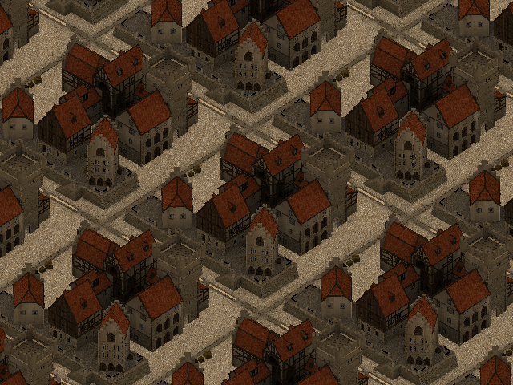

Keep in mind, though, that "worst performance" here refers to the initial implementation, and after some optimizations this exact angle / zoom may no longer indicate the worst-case performance in this scene. However, I'll keep those settings throughout all tests for consistency.

The octree itself is a voxelized version of the ["medieval kind of seaport" model by tokabilitor](https://www.blendswap.com/blends/view/50534). It's pretty heavy, so I didn't commit it to the repository directly. But if you wish to try the demo yourself, you can download the octree model [here](https://github.com/dairin0d/OctreeSplatting/releases/download/data-raw-0/PortTown-raw-octree.zip) (the instructions are inside the archive).

So! Without further ado, here are the first results (in milliseconds per frame):

| NET5 | Mono | IL2CPP |
| :-: | :-: | :-: |
| 83 | 143 | 74 |

As expected, pretty slow. Out of curiosity, let's also check the effect of different octree sorting methods:

| Configuration | Breadth-first | Depth-first | Random |
| - | :-: | :-: | :-: |
| **NET5** | 83 | 110 | 121 |
| **Mono** | 143 | 169 | 182 |
| **IL2CPP** | 74 | 100 | 114 |

In this particular case, depth-first is about 25 ms slower, and random is about 40 ms slower. In practice, these differences can be quite situation-dependent, but this demonstrates the general principle that breadth-first sorting gives the best overall worst-case.

---

## General optimizations

Our naive renderer has a few quite obvious (possibly even glaring) inefficiencies, to which the general programming wisdom suggests well-known and sure-fire solutions:

### **#1: Call it quits**

Well, maybe this is literally a viable solution to some programmers ;-) But no, here I'm simply referring to inlining method calls.

[Adding](https://github.com/dairin0d/OctreeSplatting/commit/b06679e2bc4bd5a78ceb858194d553e1b15b16d5) `[MethodImpl(MethodImplOptions.AggressiveInlining)]` to the methods used in `Render(...)` gives us this:

| NET5 | Mono | IL2CPP |
| :-: | :-: | :-: |
| 83 → 67 | 143 → 132 | 74 → 73 |

Basically no effect on IL2CPP, but an observable improvement for NET5/Mono. Can we do better?

[I manually inlined](https://github.com/dairin0d/OctreeSplatting/commit/676a8b493a95541932fa95f640277c2d436783a3) everything in `Render(...)`, except for the recursion:

| NET5 | Mono | IL2CPP |
| :-: | :-: | :-: |
| 83 → 67 | 143 → 118 | 74 → 70 |

Same result for NET5, but better results for Mono and IL2CPP. Seems to be worth it :-)

### **#2: Let's get unsafe-rous**

The simplest step in this direction is replacing arrays with pointers. It will only get rid of array bounds checking, but that's a start.

First, I tried [passing the pointers](https://github.com/dairin0d/OctreeSplatting/commit/2512b8022a39ac94236e4841f61dd353f4976b73) as extra arguments to the `Render(...)` method:

| NET5 | Mono | IL2CPP |
| :-: | :-: | :-: |
| 67 → 68 | 118 → 120 | 70 → 75 |

Hmm, this made things worse. Passing extra arguments around appears to be kind of expensive.

For an alternative approach, I [moved](https://github.com/dairin0d/OctreeSplatting/commit/07463a316ab0ab41c4526181e2e7f2fb2651e699) the `Render(...)` method to an unsafe struct:

| NET5 | Mono | IL2CPP |
| :-: | :-: | :-: |
| 67 → 64 | 118 → 116 | 70 → 71 |

That's closer to what I expected :-)

Next, instead of copying array elements into local variables, let's [use references](https://github.com/dairin0d/OctreeSplatting/commit/9872eea08079078397fdaf823aea93d41f31e1a8) to those elements. In principle, C# 7.0 allows to do this [without resorting to pointers](https://docs.microsoft.com/en-us/dotnet/csharp/programming-guide/classes-and-structs/ref-returns) (and I even used ref vars in the drawing/culling loops), but oh well :-)

| NET5 | Mono | IL2CPP |
| :-: | :-: | :-: |
| 64 → 63 | 116 → 106 | 71 → 65 |

This definitely helped.

(Out of curiosity, I also tried to rewrite the pixel-processing loops using pointers instead of the (x, y) coordinates, but it only complicated the code without any performance benefit.)

### **#3: Stacking up**

The only method call left in our rendering loop is the recursion. Let's [change it](https://github.com/dairin0d/OctreeSplatting/commit/06ba5a2228df9109238e39ece29183d0da547dd3) into a stack-based iteration. Just don't forget to add subnodes to stack in reverse order!

| NET5 | Mono | IL2CPP |
| :-: | :-: | :-: |
| 63 → 62 | 106 → 98 | 65 → 68 |

Not a consistent improvement (IL2CPP got slightly worse), but this approach will help us in the long run.

Speaking of stacks: now that we use pointers, we can also try to put all internal renderer state on the program execution stack. Here's what [`stackalloc`'ing the node stack and deltas](https://github.com/dairin0d/OctreeSplatting/commit/c23773fa9560d82894345fed45d98a92a40007e5) does:

| NET5 | Mono | IL2CPP |
| :-: | :-: | :-: |
| 62 → 63 | 98 → 97 | 68 → 65 |

Well, at least IL2CPP is back to its previous result.

### **#4: Shooting the stars**

Nowadays it's an outdated wisdom. Multiplication on modern processors is [pretty](https://stackoverflow.com/questions/6357038/is-multiplication-and-division-using-shift-operators-in-c-actually-faster) [fast](https://stackoverflow.com/questions/1168451/is-shifting-bits-faster-than-multiplying-and-dividing-in-java-net), so [removing it](https://github.com/dairin0d/OctreeSplatting/compare/c23773fa9560d82894345fed45d98a92a40007e5..b2eadba298abbcbb29ef4b9439882cd473261996) from our code might not yield any improvements. Which seems to be the case:

| NET5 | Mono | IL2CPP |
| :-: | :-: | :-: |
| 63 → 62 | 97 → 98 | 65 → 66 |

Though this didn't make the matters worse either (all changes are within the margin of error). So, eh. Let's keep it for now :-)

### **#5: Parsimony**

In this case, of statements and/or local variables, with a bit of "see what sticks" for good measure. I made an attempt to [simplify](https://github.com/dairin0d/OctreeSplatting/commit/2a9d671cf75b261f410e831a323bd30536c5afdc) the bounding rectangle calculations and the pixel inner loops, and it resulted in a surprisingly nice speed-up:

| NET5 | Mono | IL2CPP |
| :-: | :-: | :-: |
| 62 → 55 | 98 → 74 | 66 → 55 |

= = = = = = = = = =

Well, that's about all for the general-purpose optimizations (i.e., which don't introduce any changes at the conceptual level). Our renderer has gotten quite a bit faster, but it still remains the same naive algorithm at heart. To reach even better performance, it will have to get smarter ;-)

---

## Algorithmic tricks

### **#1: Pixels separately**

For starters, let's introduce a [special case](https://github.com/dairin0d/OctreeSplatting/commit/68af673c9e4717b3afc639140b8519511eceba83) for drawing nodes that are 1 pixel in size:

| NET5 | Mono | IL2CPP |
| :-: | :-: | :-: |
| 55 → 50 | 74 → 67 | 55 → 50 |

### **#2: No checks for the masked**

As you might remember, we have a table of precalculated octant sequences for all possible combinations of axis order, starting octant and node mask. Let's actually [make use](https://github.com/dairin0d/OctreeSplatting/compare/68af673c9e4717b3afc639140b8519511eceba83..5c768096f3c1c7b1f3c1a63e4f0a209999d619a4) of the node mask in our table look-up, and avoid iteration over empty octants altogether:

| NET5 | Mono | IL2CPP |
| :-: | :-: | :-: |
| 50 → 45 | 67 → 62 | 50 → 45 |

### **#3: Saving the progress**

We can [move](https://github.com/dairin0d/OctreeSplatting/commit/94752901daddceec83c8aa9320df67d149750362) bounding rectangle calculations to the subnode loop -- so that we add to the node stack only those nodes which actually overlap the viewport:

| NET5 | Mono | IL2CPP |
| :-: | :-: | :-: |
| 45 → 48 | 62 → 62 | 45 → 46 |

On its own, this doesn't provide any improvement. However, storing the bounding rectangle along with other node information allows us to [skip](https://github.com/dairin0d/OctreeSplatting/commit/d93fbd5a6169237731c9485cdc6580b7a877f6c9) the renderbuffer rows that have already been found to be occluded:

| NET5 | Mono | IL2CPP |
| :-: | :-: | :-: |
| 48 → 43 | 62 → 58 | 46 → 42 |

### **#4: Room for stencil**

Front-to-back octree splatting has a useful property: it only needs a single-bit stencil buffer for self-occlusion, and a full depth buffer only becomes necessary when an octree may intersect with another object. [Using a stencil buffer](https://github.com/dairin0d/OctreeSplatting/commit/19d47986428fb23cf5320de6a845821ef0efa76b), we can potentially reduce the number of false occlusion test passes.

In fact, we don't actually need a separate stencil buffer, since (by construction) all depth values in our renderer are ≥ 0 (0 at near plane, max depth value at far plane), so the sign bit can be used for stencil data. And in this case our depth test will also automatically work as a stencil test:

```python
# Since node.Z is always >= 0, this test will never pass
# if the sign (stencil) bit in pixel.Depth is set
if node.Z < pixel.Depth:
```

So, when writing depth values, we just bitwise OR the depth value with a sign bit. The only tricky part here is that we need to clear the stencil bits before we render another object. The easiest way would be to just clear the whole bounding rectangle, but this is quite inefficient. A better way (as far as my experiments indicated) seems to be storing the indices of each overwritten pixel, and then clearing the stencil bits of only those pixels.

| NET5 | Mono | IL2CPP |
| :-: | :-: | :-: |
| 43 → 43 | 58 → 56 | 42 → 42 |

Well... stencil test didn't really help in this particular case, but since these things are highly data-dependent, it may still come in handy in other situations.

Side note: out of curiosity, I also experimented with an explicit stencil buffer, since it allows to potentially test multiple pixels at the same time. However, in practice it created more overhead than any gains from multi-pixel testing could compensate for. Either way, according to my experiments, even completely skipping the known-to-be-occluded / out-of-view nodes and not doing occlusion test for the known-to-be-visible nodes has a rather small impact... So it's no surprise that "multi-pixel" stencil test optimization couldn't provide us with any noticeable benefit.

### **#5: XY marks the spot**

When we get to a pixel-level subnode, it sure doesn't sound fun to go through all the trouble of calculating its position, bounds and other stuff just to find out that it's occluded. Wouldn't it be awesome if we somehow magically knew which subnode will end up being visible at each pixel?

Well, yes! We can [pre-calculate](https://github.com/dairin0d/OctreeSplatting/commit/c3a324cc56903e3d76bc00fc09f80ff10ab8a92c) a small 2D map of bitmasks (or, in my case, two 1D maps for the X and Y axes), where each bit indicates an intersection of the map cell with the corresponding octant. Then, when reaching a node with pixel-sized subnodes (i.e., a node that's 2x2 pixels in size), we just do this:

```python
for y in range(yMin, yMax):
    mapY = ... # convert y from screen to map coordinates
    for x in range(xMin, xMax):
        mapX = ... # convert x from screen to map coordinates
        
        # This gets us all octants that possibly intersect this pixel
        mask = maskMap[mapX, mapY] & node.Mask
        if mask == 0: continue
        
        # Get the first octant in the front-to-back sequence
        octant = ForwardQueues[mask] & 7
        
        ... # Do the depth test, draw the octant, etc.
```

And yes, it ***is*** as awesome as it sounds:

| NET5 | Mono | IL2CPP |
| :-: | :-: | :-: |
| 43 → 33 | 56 → 49 | 42 → 34 |

= = = = = = = = = =

Whew! This was quite a ride (at least for me). With all our optimizations applied, we went from kinda-interactive to near-realtime, gaining 2x-3x speed boost compared to the initial implementation.

It's the end of the road for the renderer itself, unfortunately, and (unless I missed some additional optimization tricks) it can't be further improved within the current C#/Unity constraints.

However, it's still possible to squeeze some extra FPS out of our program ;-) But for that, we'll have to resort to...

---

## Cheating

Unlike "true" optimizations, these hacks involve concessions of some sort, and therefore can only be optional. Due to this, I will measure each one in isolation from the others.

### **#1: Cutting corners**

The octant map optimization, introduced in the previous section, allows us to skip a lot of processing for nodes 2x2 pixels in size. However, we aren't always so lucky to deal with octree projections that cleanly divide into powers of 2.

To illustrate the problem, let's consider a toy 1D case. A 4-pixel node divides into two 2-pixel nodes. A 3-pixel node also divides into two nodes (1-pixel and 2-pixel, correspondingly) -- but a lot more 3-pixel nodes can fit on the same screen, compared to the 4-pixel ones.

Well, what if we [use octant map for 3x3-pixel nodes](https://github.com/dairin0d/OctreeSplatting/commit/dc865249b1d66c500ec5bf1c483f7a5c66067b24) as well?

| NET5 | Mono | IL2CPP |
| :-: | :-: | :-: |
| 33 → 16 | 49 → 27 | 34 → 17 |

Pretty compelling! And most of the time, it looks OK too. But beware of occasional unsightly artifacts:

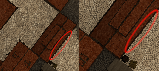

As a compromise, we can try to use a ["higher fidelity" map](https://github.com/dairin0d/OctreeSplatting/commit/cd24d35a131a8abc6ef915ef44f302f0fda71543) at 3x3 size (e.g., a map containing 64-bit masks, tested against the combined masks of the node's grandchildren). This reduces the above-mentioned artifacts, though obviously with a smaller performance gain:

| NET5 | Mono | IL2CPP |
| :-: | :-: | :-: |
| 33 → 23 | 49 → 37 | 34 → 21 |

### **#2: Job quarter done**

If a full task is too heavy for one frame, it's often worth seeking ways to distribute the work over multiple frames. The technique we can use in this case is known as ["temporal upscaling"](https://docs.unrealengine.com/4.26/en-US/RenderingAndGraphics/ScreenPercentage/), which boils down to rendering only every Nth pixel per frame.

In my [implementation](https://github.com/dairin0d/OctreeSplatting/commit/91c816a199a6419403ee209e7bde869b31cc1c31), the scene is rendered with an appropriate jitter offset to a half-resolution renderbuffer, from which then pixel data is copied to the corresponding positions in the full-resolution color buffer. Also, since we need to sample octrees at resolution higher than render target's, I added a special case for using octant map at 1x1-pixel nodes.

Here's the outcome:

| NET5 | Mono | IL2CPP |
| :-: | :-: | :-: |
| 33 → 14 | 49 → 19 | 34 → 14 |

That's even faster than the 3x3 map trick :) But how does it look?

Perfect when everything is still, but kinda noisy in motion. In games, this is typically mitigated via motion blur, but calculating motion vectors on CPU would be prohibitive. However, this technique already works kind of like a poor man's motion blur (and its noisy nature isn't particularly glaring at high framerates), so one could almost say it's a feature ;-)

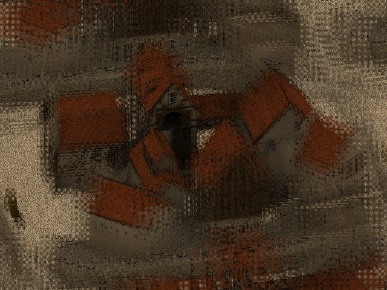

### **#3: Brute force**

The concession here is that we deviate from the pure single-threaded rendering and just put more processors to the task :-)

[Splitting the screen](https://github.com/dairin0d/OctreeSplatting/commit/7e299de064e34bde1a838c6a47e5e1960b24bb05) into horizontal slices (one for each rendering thread) resulted in this:

| Threads | 1 | 2 | 3 | 4 | 5 | 6 | 7 | 8 | 9 | 10 | 11 | 12 | 13 | 14 | 15 | 16 |
| - | :-: | :-: | :-: | :-: | :-: | :-: | :-: | :-: | :-: | :-: | :-: | :-: | :-: | :-: | :-: | :-: |
| **NET5** | 34 | 18 | 13 | 10 | 8 | 8 | 7 | 7 | 6 | 6 | 5 | 5 | 5 | 5 | 4 | 4 |
| **Mono** | 50 | 27 | 19 | 15 | 13 | 12 | 13 | 12 | 11 | 10 | 10 | 9 | 9 | 9 | 8 | 9 |
| **IL2CPP** | 35 | 18 | 12 | 9 | 8 | 7 | 7 | 6 | 6 | 5 | 5 | 5 | 4 | 4 | 4 | 4 |

I guess if you have some processors to spare, even higher resolutions could be viable :D

= = = = = = = = = =

Well, at this point we've basically did all we could in our quest for speed. That journey is now over... so if you were only looking for performance optimization tricks, I guess there's not much else left for you to read here.

However, we are still not quite done with our renderer, feature-wise. In the spirit of curiosity, let's see (or at least ponder) what other things can be bolted on top ;-)

---

## Bells and whistles

### **Level cap**

Artificially [limiting](https://github.com/dairin0d/OctreeSplatting/commit/e37ea6395340a8243d8ea9d9fa9e27289dc71295) the depth of octree traversal isn't particularly useful (mostly for debugging), but it's very simple to implement. So, why not.

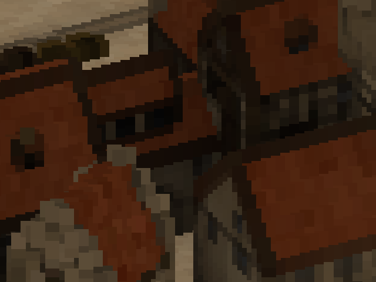

### **Splatting the atoms**

Sometimes, it may be desirable to draw larger splats than the projection of their voxels' bounding boxes -- for example, to give a more solid appearance to sparsely sampled point clouds. To achieve that, we can [dilate](https://github.com/dairin0d/OctreeSplatting/commit/70dded4a8bf41cdf5999c5523c2e1513c8f02ccb) the projected node rectangles by some amount of pixels.

Just in case, I also [implemented](https://github.com/dairin0d/OctreeSplatting/compare/70dded4a8bf41cdf5999c5523c2e1513c8f02ccb..3fe5aa23b785acb1b63a92cd51ae739cb1ebc204) an option to draw nodes as points (or, rather, at fixed size in pixels), regardless of their actual projected size. Perhaps it's also useful in some situations.

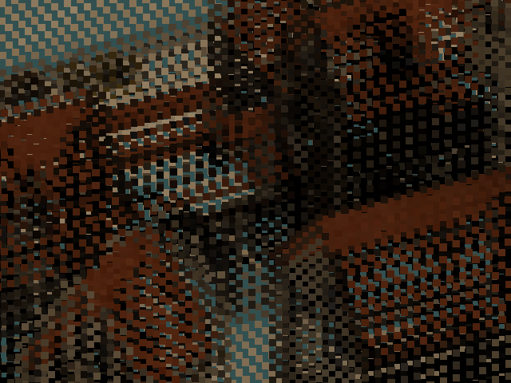

### **Cubical precision**

No self-respecting voxel renderer would consider itself complete without sporting that sharp, blocky look ;-) It can be achieved in multiple ways, but the easiest for me was just to [make a specialized variant](https://github.com/dairin0d/OctreeSplatting/compare/c3c1227d08e71162450cbbc45942b7990dfde401..37a5c44668f5fd1025ff61bfd928a17a309b5391) of the octree-rendering method that draws recursively defined "cube" octrees.

I also considered an alternative of rasterizing a voxel's hexagonal projection, but then it would have flat depth -- and that would make object intersections look weird.

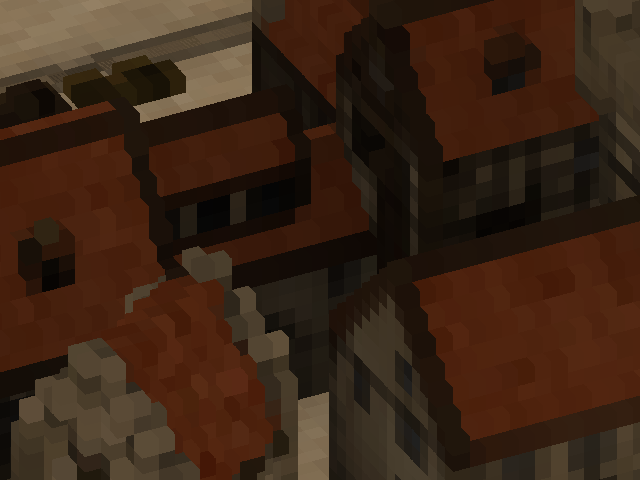

### **Going round**

However, some may prefer the look of nice, smooth circles. To that end, I [used](https://github.com/dairin0d/OctreeSplatting/commit/732e6ae2aa1e095d6f99b39685589453ffc916a2) an incremental squared-distance-to-point algorithm.

Trying to draw actual spheres with proper depth (or, for that matter, any other non-cubical volume) isn't particularly useful in our case, however, since they won't "3D intersect" other spherical nodes of the same octree anyway due to the stencil test.

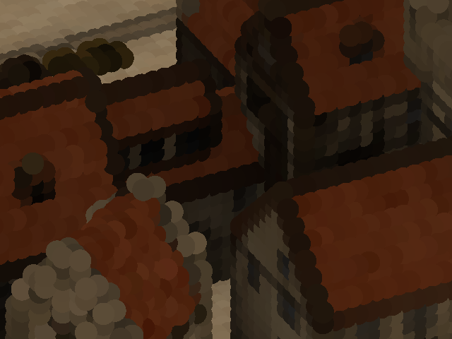

### **Crossfading data**

During my earlier experiments, I tinkered with interpolation of parent's and child's colors based on the ratio of node size to pixel size. With this, I hoped to achieve a smoother transition between LOD levels (kind of like in [trilinear filtering](https://en.wikipedia.org/wiki/Trilinear_filtering)), but the effect was hardly noticeable at all. So in the current implementation, I'm not going to bother with this feature in the first place :-)

### **Normal circumstances**

At this point, the renderer only writes color data to its render target. If we want to incorporate any sort of lighting, we also need to know the normals at each pixel. As I understand, there are mainly 3 ways to do that:

1. Calculate normals from the depth buffer. This might look okay in some cases, but is prone to artifacts and will be useless for nodes larger than a pixel.
2. Calculate normals during the octree splatting. This means an extra matrix multiplication for each written pixel, but requires access only to the local data.
3. Calculate normals after the octree splatting. This avoids matrix multiplications for pixels that get overwritten, but requires storing object ID and the raw normal data (or, alternatively, the node address) in the renderbuffer.

I don't currently have any octree datasets with normals, so I don't really know which of the last two options would be better.

Besides, lighting isn't that much useful without shadows, and rendering the scene from yet another view (for a dynamic shadowmap) will definitely tank FPS, at least for a single-threaded renderer. In principle, a shadowmap could be made using meshes and GPU... but then it kinda defeats the point of a CPU voxel renderer? Alternatively, we could precompute shadowmap(s) for the scene (or a shadow volume octree), but then it obviously would only work for static environments.

So... I guess I'll just leave it as a food for thought, or maybe for some future investigations.

= = = = = = = = = =

There may be some other ideas I could speculate about here (texture mapping, custom "shaders", etc.), but none of them are something I've been seriously thinking about. All in all, there isn't that much else left...

Except for one last important bit.

---

## Return of the samurai

The only hard limitation we may quickly run into when using our renderer, is that it can't handle projections bigger than a certain size. To view voxel models at large magnifications, we would need to split the source octree into smaller subtrees, until a given subtree is small enough to be rendered.

Both the slicing and the tiling methods could be used for that, but tiling may suffer from accumulation of floating-point errors after some number of subdivisions. Slicing possesses no such weakness, hi-ya! So, let's sharpen our katanas ;)

Since we'll be dealing with explicit cube vertices now, first we need a way to calculate the model transformation matrix from them. In [my implementation](https://github.com/dairin0d/OctreeSplatting/compare/732e6ae2aa1e095d6f99b39685589453ffc916a2..cd8bf77ba0f2de7f0fa01f7c99eef1229366ae01), I just average two opposing corners and their corresponding half-edges to get the translation vector and the X/Y/Z axes.

Onto the [subdivision itself](https://github.com/dairin0d/OctreeSplatting/commit/e503082a9582a74e8eeec147c5f3947e48c5b469): here we need a recursive traversal, so I made a helper class `CageSubdivider` with a stack of 3x3x3 grids / octant queues / some other data. After it is provided with 8 starting cube vertices and a callback (that tells whether to subdivide a given octant), it:

1. Copies the cube vertices to the corners of a grid in the stack;
2. Sorts the octant order/queue by the Z coordinate of the corresponding corners;
3. Calculates (via averaging) the remaining grid vertices;
4. Until the stack is exhausted:
    1. For each octant, passes the corresponding grid vertices to the callback;
    2. If the callback returned a "should subdivide further" value, adds a new grid to the stack and performs the first 3 steps, using the 8 vertices of the octant.

The callback, in its turn, checks for a bunch of conditions (whether the octant overlaps the viewport, whether it's too big to render or intersects the near plane, whether it's a leaf node...) to decide if a subtree can be rendered, or the octant should be subdivided further.

And... presto! Now we can zoom in much further than before:

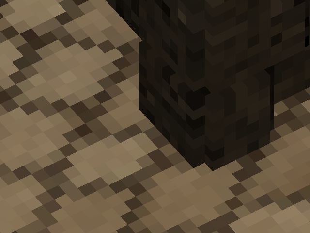

But not just that. With slicing, we now have access to **deformations and perspective!**

")

(The character model is a voxelized version of ["Samurai Mayumi" by SurplusBun](https://sketchfab.com/3d-models/samurai-mayumi-1ef5be384abc48f299f4e87d92af46b6). If you wish to test it yourself, the corresponding octree can be downloaded [here](https://github.com/dairin0d/OctreeSplatting/releases/download/data-character/Character-raw-octree.zip).)

All that's needed is an [additional check](https://github.com/dairin0d/OctreeSplatting/compare/e503082a9582a74e8eeec147c5f3947e48c5b469..95ab1e083f58750b763d9d58d9be10da63d5707c) in the subdivision callback. The more you subdivide a deformed cube, the closer to a parallelepiped each sub-cube becomes -- so we just need to check whether the cube's edges are parallel enough. The amount of parallelism (or, alternatively, distortion) can be estimated, for example, from the difference between the cube's opposite edge vectors.

The final subdivision logic [ended up](https://github.com/dairin0d/OctreeSplatting/blob/b4355f9f5a93e9ecc9963096644c07f0abccb7ba/Unity/OctreeSplatting/Assets/OctreeSplatting.Demo/DemoController.cs#L573-L607) looking something like this:

```
if node does not overlap the viewport:
    skip
else if node intersects the near plane:
    if it's a leaf node:
        skip
    else:
        subdivide
else if node is too big:
    subdivide
else if node is too distorted:
    if using cube shape or node is non-leaf:
        subdivide
    else:
        render
else:
    render
```

However, since "parallel enough" is not "exactly parallel", the neighboring subtrees will never quite match on the edges, which occasionally manifests as "seams":

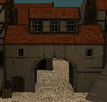

I tried [dilating the subtrees](https://github.com/dairin0d/OctreeSplatting/compare/95ab1e083f58750b763d9d58d9be10da63d5707c..74bdfd018397e9b609b44ce6cef0459d00e282dc) by their amount of distortion, but this didn't solve the problem completely. My suspicion is that, while the holes between the subtrees are covered, the dilated black voxels on the inside of the buildings still peek through the outer walls where the seams meet. And since dilated dense models are slower to render, in the end I disabled this effect.

A more promising approach would probably be a post-processing hole-filling filter, similar to what is used in point cloud rendering [[F1](hole-filling-1), [F2](hole-filling-2), [F3](hole-filling-3)]. But these sorts of things are much better suited for a shader, which is kinda beyond the scope of this project.

[hole-filling-1]: https://hal.archives-ouvertes.fr/hal-01959578/document "Raw point cloud deferred shading through screen space
pyramidal operators"
[hole-filling-2]: https://www.researchgate.net/profile/Paul-Rosenthal/publication/231217483_Image-space_Point_Cloud_Rendering/links/0fcfd50660e9b1a5ef000000/Image-space-Point-Cloud-Rendering.pdf "Image-space Point Cloud Rendering"
[hole-filling-3]: http://indigo.diginext.fr/EN/Documents/vast2011-pbr.pdf "Real-time Rendering of Massive Unstructured Raw Point Clouds using Screen-space Operators"

If you decide to take a look at my code, keep in mind that handling subdivisions is not very optimized there. But since I added support for deformations mostly for demonstration purposes, I didn't particularly bother with that.

---

## Vs. Animation

So! Now that we know we can do deformations, let's talk a bit about animations ;-)

Of course, rigid (non-deforming) and flip-book (each frame is a separate octree) animations are trivial for voxel models. But skeletal animation is trickier, as the usual approaches aren't directly applicable.

Surprisingly, there doesn't seem to be that much material on the subject of combining skinning with octrees. The only notable exception is probably Dennis Bautembach's ["Animated Sparse Voxel Octrees"](http://masters.donntu.org/2012/fknt/radchenko/library/asvo.pdf), popularly explained in [this](https://www.youtube.com/playlist?list=PLfuJEfUHg4HGC-pS85iam40FmG9vyLYcR) short series of videos. His technique (implemented in [CUDA](https://en.wikipedia.org/wiki/CUDA)) essentially traverses the octree to a LOD level sufficient for display, and then transforms each voxel at that level as if it was a regular mesh vertex. Naturally, this can lead to holes between the transformed voxels, which he counters by enlarging each voxel by some amount. Dennis also considers transforming the 8 corners of a voxel instead of just the center (in order to eliminate holes), but he notes that this is too computationally expensive. In the end, he concludes that this technique is mostly suitable for moderate deformations.

Obviously, we can't afford anything of this sort in our CPU renderer. However, there exists another (and pretty popular!) animation technique that's perfectly compatible with octrees: [*cage deformations!*](http://www.immagery.com/pdf/cage_based_def_methods.pdf) Or, at least, their linear variant.

In essence, this is a direct extension of textured triangles / quads to 3D. Texture (2D array of pixels) becomes 3D array of voxels, and triangles / quads become tetrahedrons and cuboids, respectively. So if we split a high-detail model into a collection of connected cubical / tetrahedral volumes (which together form a cage) and assign bone weights to their vertices, the *cage itself* may be animated using any of the traditional techniques. As a result, we get a skeletally animated voxel/point-cloud model (composed of many small octrees) at a much lower price :)

Interestingly, back in 2019 Atomontage engine released a [teaser video](https://www.youtube.com/watch?v=TCCJ88OCQX4) with a (what I assume) skeletally animated voxel dragon swinging its head left and right. I have no idea what approach Atomontage uses there, but I wouldn't be surprised if it's something along the same lines.

---

## Afterword

And just like that, you've reached the end of my narration. Hopefully, it took you on (a very abridged version of) the same journey I made over these years. Was it any useful?

For me, it was. I still don't have the slightest idea what exactly gave 2010's Unlimited Detail its claimed performance (30 FPS at 1024x768 on a budget laptop), but at this point I'm pretty sure it's more down to SIMD and low-level optimizations than some genius algorithmic tricks. At long last, I can consider my curiosity satisfied -- and, having published a detailed overview of my findings, now can finally put this quest to rest with a peace of mind.

Perhaps some of this information will come up useful even for you too, if you decide to write your own renderer or improve upon mine. And if not -- well, I hope at least this was an entertaining read :-)

Good luck in your endeavors!

***dairin0d***, 2021

---

## P.S.

I had a couple of "historical context" notes that didn't quite fit the flow of the main text. It's nothing important, but if you're curious -- here they are:

### **Comparing notes with PND3D, Atomontage and pabloreda's renderer**

Near the end of 2018, Ken Silverman [released](http://advsys.net/ken/voxlap/pnd3d.htm) the source code for his PND3D demo (although I didn't find out about that until mid-2021, when I started writing this article), alongside a readme file where he described the tricks used in his engine. Interestingly, there aren't that many:

1. Predicting which 4 vertices contribute to the bounding rectangle
2. Splitting the screen into tiles (for multithreading)
3. Skipping occlusion test for nodes larger than 32 pixels
4. Using a small stencil buffer and testing an entire row for occlusion
5. Rasterizing leaf voxels as convex hexagons and raycasting cube faces on GPU
6. Using SIMD instructions (and, I assume, a lot of optimized assembly)

Indisputably, PND3D is very fast (though it would be cool to make an apples-to-apples comparison with my renderer... but alas, not with my skills or free time). However, perhaps ironically, none of the tricks mentioned by Ken ended up useful in my case:

1. Since I wanted to support deformations, predicting bounding rectangle vertices is impossible in the general case.
2. This would be genuinely useful for multithreading, but my focus here was on the single-threaded performance.
3. A long time ago I tried something similar, but it didn't bring any improvement, or maybe even was slower.
4. As I mentioned [earlier](#4-room-for-stencil), in my experiments the overhead of multi-pixel stencil testing only made things worse. Though I haven't looked at Ken's code... maybe he found a way to do it very efficiently?
5. I had no intention of supporting textured voxels, so this is simply not applicable in my case.
6. .NET framework has SIMD support since some version, but it doesn't work in Unity's fork of Mono. Since I wanted to run my renderer both in .NET and Unity, I had to refrain from using it. And as for assembly-level optimizations... not in the [CLR](https://en.wikipedia.org/wiki/Common_Language_Runtime) land ;-)

As for Atomontage, it's not so much comparing notes as just one interesting bit of information I've stumbled across. It seems to be using raycasting (at least according to the title of [this 2016 video](https://www.youtube.com/watch?v=R9CA8i2Of_g)), but in 2010 Branislav mentioned (in comments) that ["AE is still mostly CPU-based"](https://www.youtube.com/watch?v=_CCZIBDt1uM) and ["we had the necessary hardware some 7-10y(!!!) ago already"](https://www.youtube.com/watch?v=1sfWYUgxGBE). I can't even *begin* to comprehend what sort of crazy raycasting algorithm he must have invented that could do Atomontage-quality realtime raycasting on the 2000s-era CPUs... Or maybe I'm just reading it the wrong way. But hey, kudos to the man if that's actually true! Perhaps he's the one who will finally prove the impracticality of CPU renderers wrong :-)

*Edit (December 2021):* Well, an early version of Atomontage got finally [released](https://venturebeat.com/2021/11/30/atomontage-launches-early-version-of-cloud-based-volumetric-graphics/), and at least in the web demo it doesn't use any sort of CPU rendering (in fact, some people [suspect](https://www.reddit.com/r/VoxelGameDev/comments/r5tsfb/comment/hmry22t/?utm_source=share&utm_medium=web2x&context=3) it might not even use raycasting, and simply relies on traditional polygon rendering). Perhaps *that's* what Branislav meant when he mentioned 2000s-era hardware..?

*Edit (December 2021):* A few months after I published these results, I stumbled upon a [series of blog posts](https://www.gamedev.net/blogs/blog/4192-experimental-graphics-technology/) written in 2020 by Pablo Reda, where he outlines the design of his software octree raycaster. Though our approaches obviously differ in some ways, it seems we ended up using quite a number of the same core ideas. I guess it goes to show that these sorts of optimizations are pretty fundamental, and many programmers would eventually come to them after thinking long enough :-)

### **Other things I tried**

#### **▸ Classic octree raycasting**

Using the [3D DDA](https://www.scratchapixel.com/lessons/advanced-rendering/introduction-acceleration-structure/grid) algorithm for traversing node children. At that point, I had very little experience with rendering algorithms, so my implementation wasn't just super slow, but also super glitchy.

#### **▸ Stochastic point cloud splatting with "reprojection"**

This was loosely inspired by MediaMolecule's [Dreams](https://www.youtube.com/watch?v=u9KNtnCZDMI). On start, I randomized the order of points in each model, then each frame splatted a subrange of model's points (the subrange size was determined from the frame budget) and also the points that were visible in the previous frame. Unfortunately, it converged too slowly, and any solidity was quickly destroyed when the camera or a model was rotated.

#### **▸ "Chain-like" point splatting**

This was inspired by the ["Caviar" 3D model format](https://alphacentauri2.info/wiki/Caviar) used in Sid Meier's Alpha Centauri. There, the model is split into "voxel strips" where each next voxel is adjacent to the previous one (or is within a small neighborhood). This allows to encode all subsequent voxel positions as few-bit offset codes, and to calculate their actual positions with 3 additions instead of a matrix multiplication. Drawing points this way is very fast, but there's still too much work being wasted on points that get occluded.

#### **▸ Wave surfing ("heightmap" raycasting)**

This is a [tried-and-true](https://github.com/s-macke/VoxelSpace) [method](https://web.archive.org/web/20050206144506/http://www.flipcode.com/articles/voxelland_part02.shtml), most notably used in some early [Novalogic games](https://en.wikipedia.org/wiki/Voxel_Space). Originally, it could only handle heightmaps, but was later [extended](http://www.advsys.net/ken/voxlap.htm) by Ken Silverman to render RLE-encoded [stacks of voxels](https://stackoverflow.com/questions/3794306/can-someone-describe-the-algorithm-used-by-ken-silvermans-voxlap-engine) at arbitrary orientations. There was also an isometric game [Hexplore](https://www.mobygames.com/game/windows/hexplore/screenshots) which, most likely, used a similar approach.

I made an attempt to do [something similar](https://github.com/dairin0d/OctreeSplatting/blob/main/Unity/OctreeSplatting/Assets/VoxelStackRendering.Demo), but didn't go very far in that direction. Under certain limitations, this could be quite fast, but in general it just doesn't scale as well as tree-based methods.

#### **▸ Splatting-like "raycasting"**

This is essentially the same as front-to-back octree splatting, only optimized for the case of a single pixel. For a given relative orientation of an octree to an orthographic camera, I precomputed a small (32x32) map, where each cell (map pixel) was a bitwise OR of masks of all octants which intersected that cell. Then, for each pixel in the octree's projected rectangle, I traversed the octree (until node size was less than a pixel or the depth-test failed), sampling the map at the corresponding position to determine which of the node's octants actually need to be traversed.

Of course, for more than one pixel this results in a lot of repeated work (not to mention a lot more cache misses), so this was about an order of magnitude slower than splatting. Potentially, some work could be shared via beam tracing... but occlusion-culled splatting is kind of like extreme version of beam tracing anyways, and, as you've seen above, I later used the map idea to speed up the splatting of 2x2 pixel nodes.

#### **▸ Traverse-order caching**

During my initial experiments, I didn't know about the breadth-first octree storage, so my renderer was quite slowed down by a large amount of cache misses. To try to mitigate that, back then I implemented a rather elaborate system that cached octree nodes in the order of their traversal, so on subsequent re-traversals the cache coherency was typically much better.

However, while this solution improved the average performance in my test scenes, it was too impractical to be really useful: it required a lot of extra memory to store just one buffer with the traverse-order copies of nodes (and for each additional view / camera, the memory requirements would be correspondingly multiplied), and in the worst-case scenario (when no nodes from the previous frame can be reused) it would actually be slower than no caching at all. So when I switched to breadth-first storage, I was quite happy to sacrifice a bit of average-case performance for not having to deal with that memory-hungry maintenance nighmare :-)

---

## The end!

<p xmlns:cc="http://creativecommons.org/ns#" >This work is licensed under <a href="http://creativecommons.org/licenses/by/4.0/?ref=chooser-v1" target="_blank" rel="license noopener noreferrer" style="display:inline-block;">CC BY 4.0</a></p>